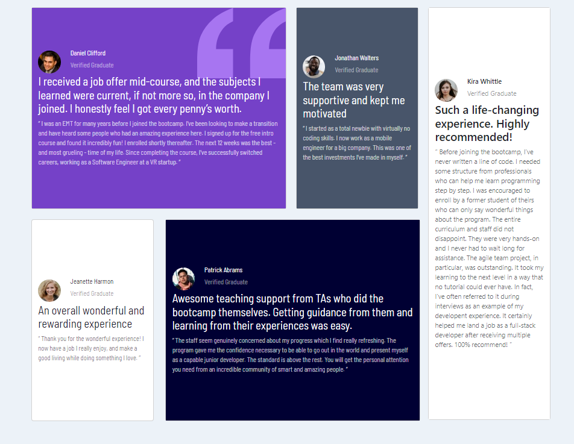

# Frontend Mentor - Testimonials grid section solution

This is a solution to the [Testimonials grid section challenge on Frontend Mentor](https://www.frontendmentor.io/challenges/testimonials-grid-section-Nnw6J7Un7). Frontend Mentor challenges help you improve your coding skills by building realistic projects. 

## Table of contents

- [Overview](#overview)
  - [The challenge](#the-challenge)
  - [Screenshot](#screenshot)
  - [Links](#links)
- [My process](#my-process)
  - [Built with](#built-with)
  - [What I learned](#what-i-learned)
  - [Continued development](#continued-development)
- [Author](#author)

## Overview

### The challenge

Users should be able to:

- View the optimal layout for the site depending on their device's screen size

### Screenshot

### Links

- Solution URL: [Github](https://github.com/cmb347827/testimonials-grid-section-main)
- Live Site URL: [Live Github](https://cmb347827.github.io/testimonials-grid-section-main/)

## My process

### Built with

- Semantic HTML5 markup
- Bootstrap
- Sass/SCSS
- Mobile-first workflow

### What I learned

- From now on I will start coding the layout with almost empty elements, instead of with 
  all the text , as I'm still learning , it was unwieldy to oversee. 
- I used the Scss @each directive for the first time. It made it easier to apply the same code to numerous elements.
- I have coded this type of grid layout in the past using CSS grids, but this time I wanted to use only Bootstrap, which was 
  a bit of a challenge. I think it would have been easier in just CSS grid.

### Continued development

- Daily tutorials and projects in HTML5, CSS3, Javascript, Bootstrap, Sass/SCSS, some jQuery. For now, in time I will go re-learn React ect.

## Author

- Website - [One of my latest codepens](https://codepen.io/cynthiab72/pen/oNybYON)
- Frontend Mentor - [@cmb347827](https://www.frontendmentor.io/profile/cmb347827)
